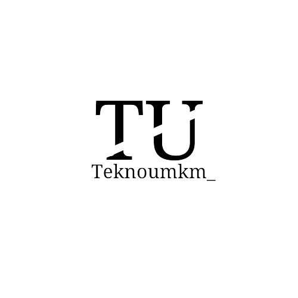

<div align="center">



# 🚀 Tekno UMKM

### _Solusi Teknologi Digital untuk Kemajuan UMKM Indonesia_

[](https://www.gnu.org/licenses/gpl-3.0)
[](https://developer.mozilla.org/en-US/docs/Web/HTML)
[](https://developer.mozilla.org/en-US/docs/Web/CSS)
[](https://developer.mozilla.org/en-US/docs/Web/JavaScript)
[](https://tailwindcss.com/)
[](https://nasrulaminmuis.github.io/teknoumkm/)

**[🌐 Lihat Website Live](https://nasrulaminmuis.github.io/teknoumkm/)** · **[📖 Detail Teknologi](https://nasrulaminmuis.github.io/teknoumkm/tekno.html)** · **[💬 Testimoni](https://nasrulaminmuis.github.io/teknoumkm/testi.html)**

</div>

---

## 📌 Tentang Proyek

**Tekno UMKM** adalah website edukatif yang dirancang untuk membantu **Usaha Mikro, Kecil, dan Menengah (UMKM)** Indonesia dalam memahami dan memanfaatkan teknologi digital demi pertumbuhan bisnis yang lebih pesat dan efisien.

Website ini menyajikan informasi mendalam tentang lima teknologi utama yang relevan bagi pelaku UMKM, mulai dari platform e-commerce hingga software ERP, dilengkapi dengan testimoni nyata dari para pelaku usaha.

---

## ✨ Fitur Unggulan

| Fitur | Keterangan |
|-------|------------|
| 🌓 **Dark / Light Mode** | Tampilan tema gelap & terang yang dapat disesuaikan |
| 📱 **Responsif** | Tampilan optimal di semua perangkat (mobile, tablet, desktop) |
| ❓ **FAQ Interaktif** | Accordion FAQ yang bisa diklik untuk memperluas jawaban |
| 🧭 **Navigasi Mobile** | Menu hamburger khusus untuk perangkat seluler |
| 🔄 **Smooth Scrolling** | Animasi gulir halaman yang mulus |
| 🖼️ **Desain Modern** | UI bersih dengan warna-warna elegan dan tipografi nyaman |

---

## 🛠️ Teknologi yang Digunakan

<div align="center">

| Teknologi | Fungsi |
|-----------|--------|
|  | Struktur halaman web |
|  | Animasi & styling kustom |
|  | Framework CSS utility-first |
|  | Interaktivitas & logika UI |
|  | Ikon-ikon antarmuka |
|  | Hosting & deployment |

</div>

---

## 📚 Konten Teknologi

Website ini membahas **5 teknologi digital** yang bisa diterapkan oleh UMKM:

<table>
  <tr>
    <th>No</th>
    <th>Teknologi</th>
    <th>Deskripsi</th>
  </tr>
  <tr>
    <td>1</td>
    <td>🛒 <strong>Platform Belanja Online (E-Commerce)</strong></td>
    <td>Cara membuka toko online, strategi penjualan, dan keamanan transaksi digital</td>
  </tr>
  <tr>
    <td>2</td>
    <td>📣 <strong>Pemasaran Online (Digital Marketing)</strong></td>
    <td>Strategi pemasaran digital melalui media sosial, SEO, dan iklan online</td>
  </tr>
  <tr>
    <td>3</td>
    <td>🤖 <strong>Chatbot Teknologi</strong></td>
    <td>Otomatisasi layanan pelanggan dengan chatbot berbasis AI</td>
  </tr>
  <tr>
    <td>4</td>
    <td>📊 <strong>Big Data Teknologi</strong></td>
    <td>Analitik data untuk pengambilan keputusan bisnis yang lebih cerdas</td>
  </tr>
  <tr>
    <td>5</td>
    <td>💼 <strong>Software ERP</strong></td>
    <td>Manajemen bisnis terpadu dengan Enterprise Resource Planning</td>
  </tr>
</table>

---

## 🗂️ Struktur Halaman

```
teknoumkm/
├── 📄 index.html          # Halaman utama (Hero, Teknologi, FAQ, Footer)
├── 📄 tekno.html          # Detail masing-masing teknologi
├── 📄 testi.html          # Halaman testimoni pelaku UMKM
├── 🎨 style.css           # Styling kustom & animasi
├── ⚙️  script.js           # Logika navigasi, FAQ, dan tema
├── 🖼️  gambar/             # Aset gambar (logo, background, ilustrasi)
├── ⚙️  tailwind.config.js  # Konfigurasi Tailwind CSS
└── 📜 LICENSE             # GNU General Public License v3
```

---

## 🚀 Cara Menggunakan

### Jalankan Secara Lokal

1. **Clone repositori ini:**
   ```bash
   git clone https://github.com/nasrulaminmuis/teknoumkm.git
   ```

2. **Masuk ke folder proyek:**
   ```bash
   cd teknoumkm
   ```

3. **Buka file `index.html` di browser** (tidak perlu server atau instalasi apapun):
   ```bash
   # Dengan VS Code Live Server, atau langsung buka file
   open index.html
   ```

> ✅ Tidak memerlukan instalasi npm, pip, atau dependensi apapun.  
> ✅ Bisa langsung dijalankan di browser manapun.

---

## 🌐 Demo Website

Kunjungi website secara langsung di:  
**👉 [https://nasrulaminmuis.github.io/teknoumkm/](https://nasrulaminmuis.github.io/teknoumkm/)**

---

## 🤝 Kontribusi

Kontribusi sangat kami sambut! Silakan ikuti langkah berikut:

1. **Fork** repositori ini
2. Buat **branch** baru: `git checkout -b fitur/nama-fitur`
3. **Commit** perubahan: `git commit -m 'Tambah fitur baru'`
4. **Push** ke branch: `git push origin fitur/nama-fitur`
5. Buat **Pull Request**

---

## 📄 Lisensi

Proyek ini dilisensikan di bawah **GNU General Public License v3.0**.  
Lihat file [LICENSE](LICENSE) untuk informasi selengkapnya.

---

<div align="center">

Dibuat dengan ❤️ untuk memajukan **UMKM Indonesia** di era digital

⭐ **Jika proyek ini bermanfaat, berikan bintang di GitHub!** ⭐

</div>